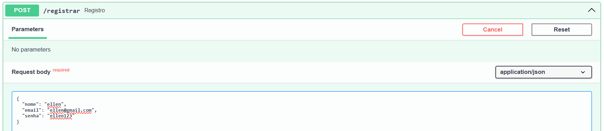
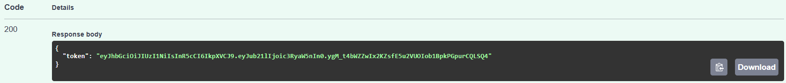
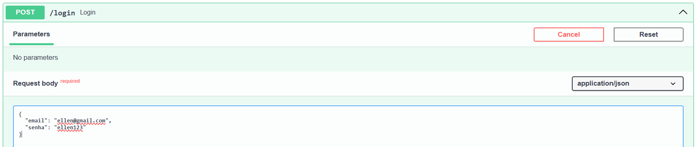
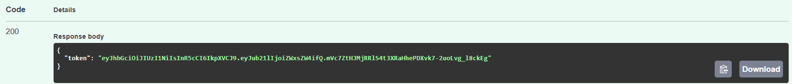
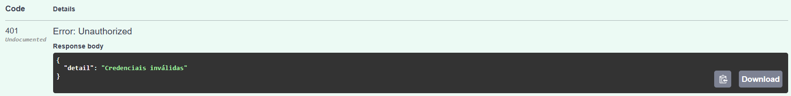
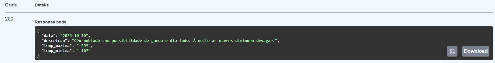
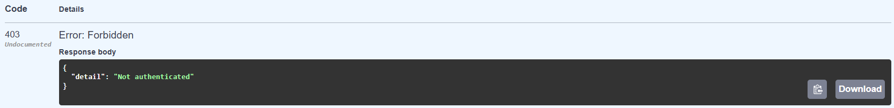

A API possui suporte à 3 endpoints:

1. POST /registrar
    
    Atribuição de registrar um usuário na base de dados
    
    - Retorna 200 quando o registro criado com sucesso, com token JWT atribuído no cadastro
    
    
    
    - Retorna 409 quando o email já foi registrado
    

2. POST /login

    Atribuição de gerar um token JWT (utilizado como modo de autenticação) somente aos usuários que já estiverem registrados na base de dados

    - Retorna 200 quando a autenticação foi bem sucedida
    
    

    - Retorna 401 quando parte das credenciais estão inválidas
    

3. GET /consultar

    Atribuição de checar se o usuário a fazer a solicitação está autenticado, para assim fornecer as informações do webscrapping. Isso significa observar se o token JWT contido no campo "Authentication: Bearer" do header da requisição é válido.

    - Retorna 200 quando a autenticação é bem sucedida, então retorna as informações do clima
    

    - Retorna 403 quando o token JWT submetido no header da requisição não é coerente com o token do login
    